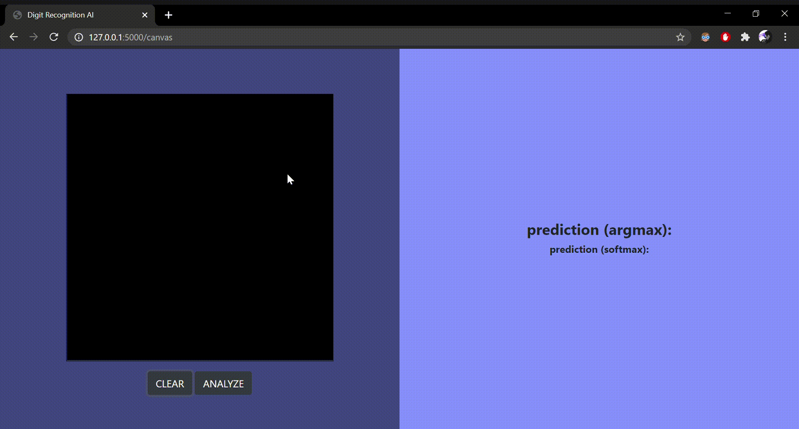

# Digit-Recognition-AI
This model has been trained on a sub-sample of 10.000 images from the MNIST dataset using `Keras`.
You can check [this pdf](https://github.com/MINACCI/Digit-Recognition-AI/blob/master/test/Testing_ConvolutionalNeuralNetwork.pdf) for more details on the AI.

### Demo using the model in `Flask`

   
   

